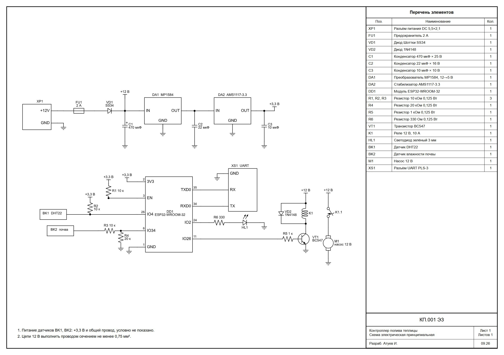
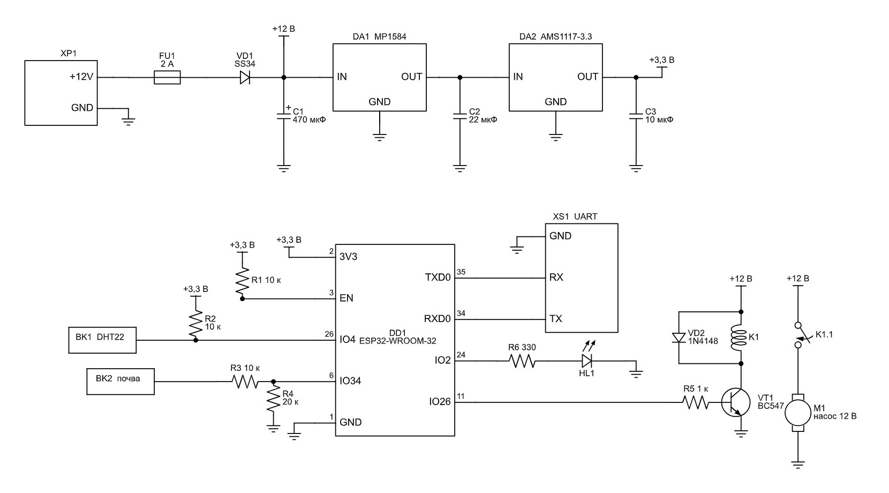
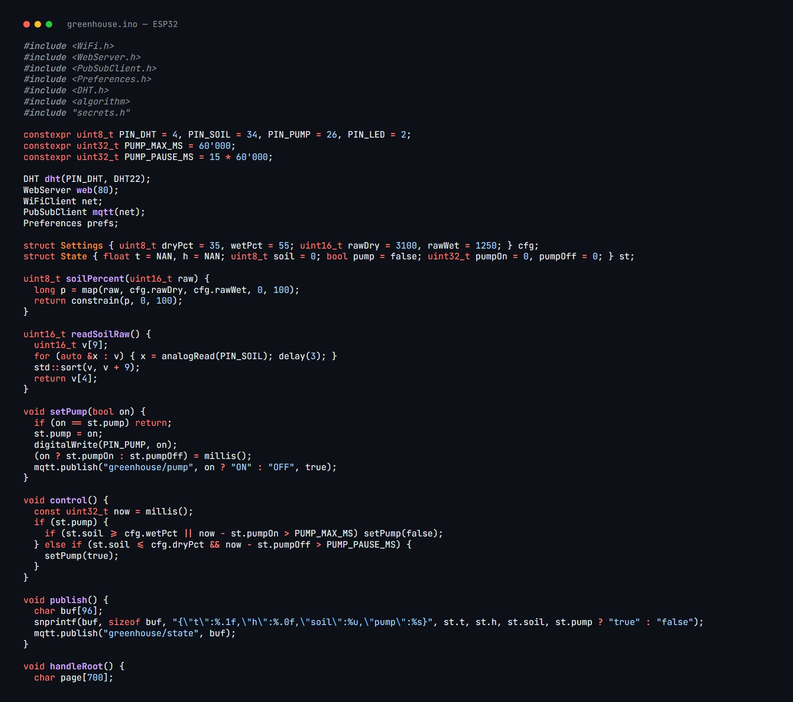

# esp32-greenhouse

Greenhouse controller on ESP32: soil moisture, air temperature and humidity, light, a pump and a fan, with a web dashboard served by the board itself.

## Hardware

- ESP32-WROOM-32, DHT22 air sensor, capacitive soil moisture sensor on ADC1
- pump driven from a GPIO through a switching stage, status LED
- 12 V input with fuse and reverse-polarity diode SS34, MP1584 buck to 5 V, AMS1117 LDO to 3.3 V
- the schematic is generated from code with schemdraw (`hardware/schematic.py`), so the drawing always matches the pin map in the firmware

## Firmware

- non-blocking loop on `millis()` timers
- watering with a hard safety limit: the pump never runs longer than 60 s and then rests for 15 minutes, even if the soil sensor fails
- dry and wet thresholds calibrated from the web page and stored in NVS (`Preferences`), they survive a power loss
- built-in web server with live readings and settings, MQTT publishing for Home Assistant or Node-RED

Build with Arduino IDE or PlatformIO, board `esp32dev`.
